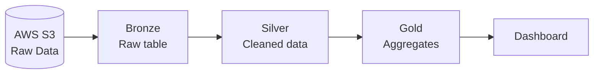

# Flight Data Lakehouse
 
A medallion-architecture lakehouse built on **AWS S3** and **Databricks**. Raw aircraft data (OpenSky Network) is stored in S3, transformed through Bronze → Silver → Gold, and visualized in a Databricks dashboard.
 
## Architecture
 

 
| Layer | What it does |
|-------|--------------|
| 🥉 **Bronze** | Raw data from S3, untouched |
| 🥈 **Silver** | Renamed columns, UTC timestamps, unit conversions (km/h, knots, feet), data-quality flags |
| 🥇 **Gold** | Aggregated tables for reporting |
 
## Gold Tables
 
- `gold_flight_activity_hourly`: activity by hour
- `gold_aircraft_country_summary`: activity by origin country
- `gold_aircraft_altitude_summary`: activity by altitude band
- `gold_flight_geographic_activity`: activity by 5° lat/lon grid
## Dashboard
 
Built on the Gold tables: KPI counters (total, airborne, on-ground, distinct aircraft), observations over time, top countries, altitude and velocity breakdowns, and geographic activity.
 
<!--  -->
 
## Repo Structure
 
```
├── transformations/
│   ├── silver/
│   └── gold/
├── Aircraft Dashboard.lvdash.json
└── README.md
```
 
## Tech Stack
 
AWS S3 · Databricks · PySpark · Delta Lake · Lakeflow Declarative Pipelines
 
## Data Source
 
[OpenSky Network](https://opensky-network.org/)
 
